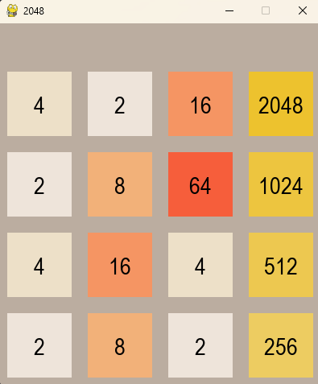
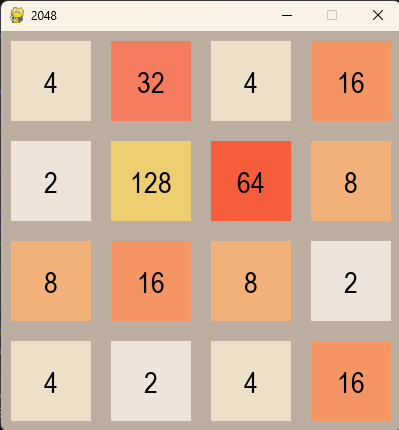

# 2Q48: Exploring Quantum Reinforcement Learning in the 2048 Game

Welcome to the repository for **2Q48**, a project exploring the potential of Quantum Reinforcement Learning (QRL) in solving the popular tile-merging game, 2048. This project compares heuristic, classical reinforcement learning (RL), and quantum RL approaches to evaluate their efficiency, decision-making strategies, and performance in a grid-based environment.

---

## **Motive**

The goal of this project is to explore the intersection of quantum computing and reinforcement learning by applying them to a complex, strategic decision-making game. By leveraging parameterized quantum circuits, we aim to understand how quantum principles can enhance the representation and optimization of states in an RL framework. While QRL is in its infancy, this project serves as a stepping stone to further investigate its potential in real-world applications and computationally challenging environments.

---

## **Installation**

### **Requirements**
- Python 3.8+
- PennyLane
- TensorFlow
- NumPy

### **Steps**
1. Clone the repository:
   ```bash
   git clone https://github.com/Ashad001/2Q48.git
   cd 2Q48
   ```

2. Create a virtual environment and activate it:
   ```bash
   python -m venv env
   source env/bin/activate  # On Windows: env\Scripts\activate
   ```

3. Install the dependencies:
   ```bash
   pip install -r requirements.txt
   ```

4. To train agents, use the script provided by [DineshDhanji](https://github.com/DineshDhanji):
   ```bash
   python initialize.py
   ```
   The agent training script can be found at [here](https://github.com/DineshDhanji/2Q48/blob/master/initialize.py).

---

## **Results**

### **Overview**
The three approaches—heuristic, classical reinforcement learning, and quantum reinforcement learning—were tested to compare their performance in terms of move efficiency, achieved tile values, and overall gameplay behavior. Below are the rendered game outputs and insights from the experiments.

### **Rendered Results**
- **Heuristic Approach:**  
  - Consistently reached the 2048 tile in most simulations.  
  - Demonstrated high efficiency and speed due to its predefined strategy.  
  

- **Classical Reinforcement Learning (RL):**  
  - Achieved moderate success, typically reaching up to the 128 tile.  
  - Performance was constrained by slower convergence and challenges in handling the dynamic nature of the game.  
  

- **Quantum Reinforcement Learning (QRL):**  
  - Reached a maximum of the 256 tile occasionally.  
  - Highlighted the potential of quantum circuits but was limited by the computational demands and early-stage development of quantum technologies.  
  

---

## **Methodology**

### **Heuristic Approach**
A rule-based algorithm that strategically merges tiles to maximize scores while avoiding early game termination. Its logic ensures fast and efficient gameplay with consistent results.

### **Classical Reinforcement Learning**
Implemented using Deep Q-Networks (DQNs), this agent learns through exploration and exploitation:
- A replay buffer stores state-action-reward transitions.
- Q-values are updated based on Bellman equations using a neural network.

### **Quantum Reinforcement Learning**
A Quantum Deep Q-Network (QDQN) integrates quantum circuits with classical layers:
- **Quantum Circuit:** Encodes the state using parameterized quantum gates for decision-making.  
- **Hybrid Model:** Combines quantum outputs with classical dense layers to predict Q-values.  
- **Training Pipeline:** Follows traditional RL training with quantum-enhanced computations via PennyLane.  

For more details on the training process, refer to the [initialize.py script](https://github.com/DineshDhanji/2Q48/blob/master/initialize.py).

---

## **Future Work**

1. **Optimizing Quantum Circuits:**  
   Explore advanced quantum circuit designs and optimization techniques to improve QRL performance.  

2. **Scalability:**  
   Extend the QRL framework to larger state spaces and more complex decision-making environments.  

3. **Algorithmic Enhancements:**  
   Integrate quantum-inspired techniques with heuristic and classical RL models for hybrid solutions.  

---

## **Contributions**

The project was a collaborative effort aimed at pushing the boundaries of game-based AI by integrating quantum principles into reinforcement learning strategies. While quantum RL did not outperform classical methods, the insights gained from this project lay the groundwork for future innovations in quantum AI.

---

## **Contact**
For any queries, please feel free to reach out via [GitHub Issues](https://github.com/Ashad001/2Q48/issues).

--- 

Enjoy exploring the potential of Quantum Computing and Quantum RL with 2Q48!!!!